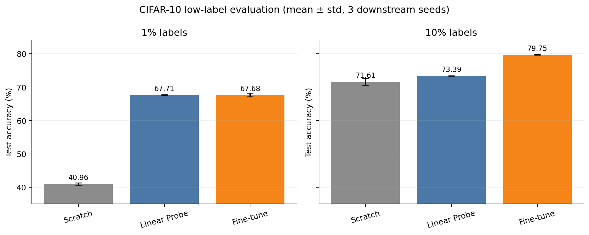
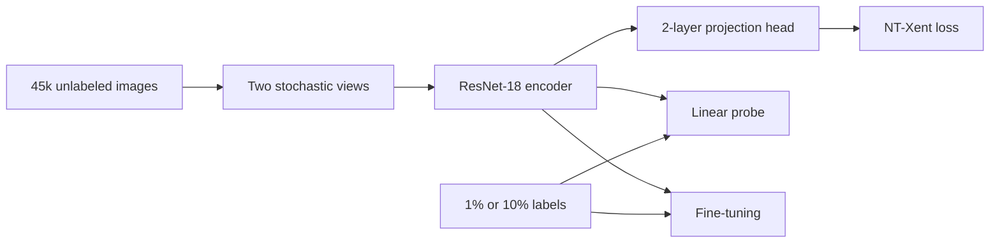
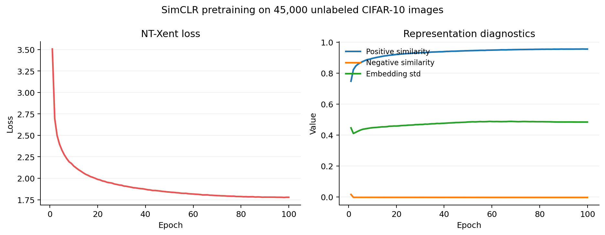
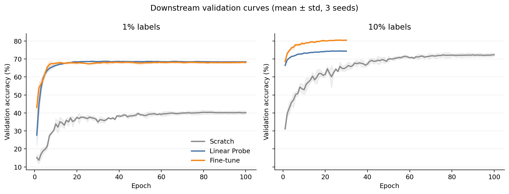
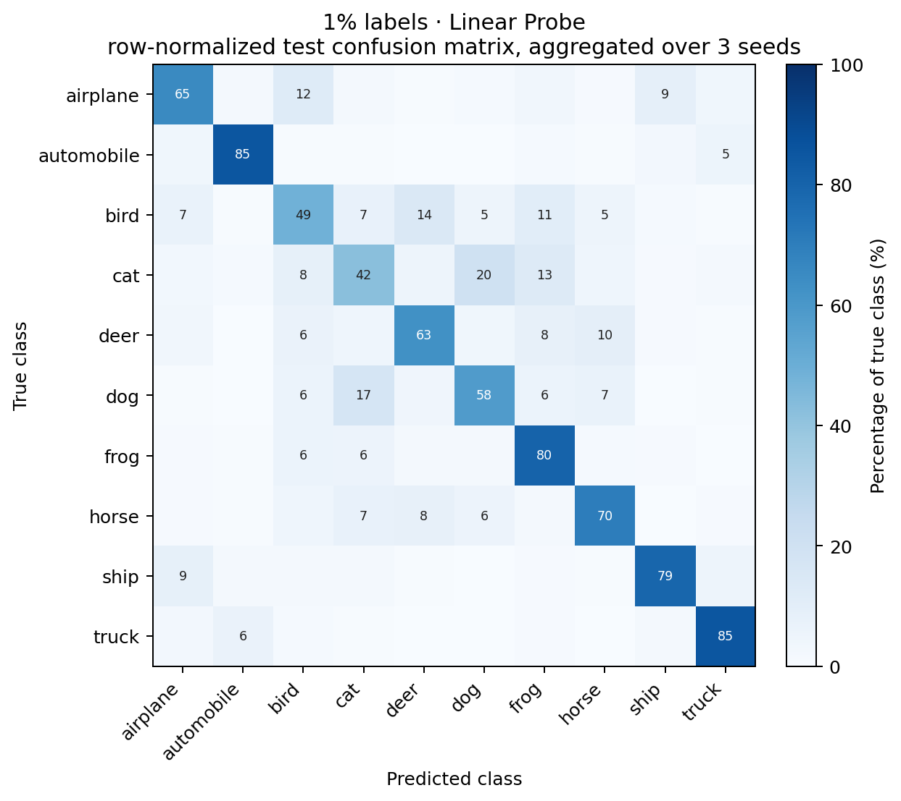
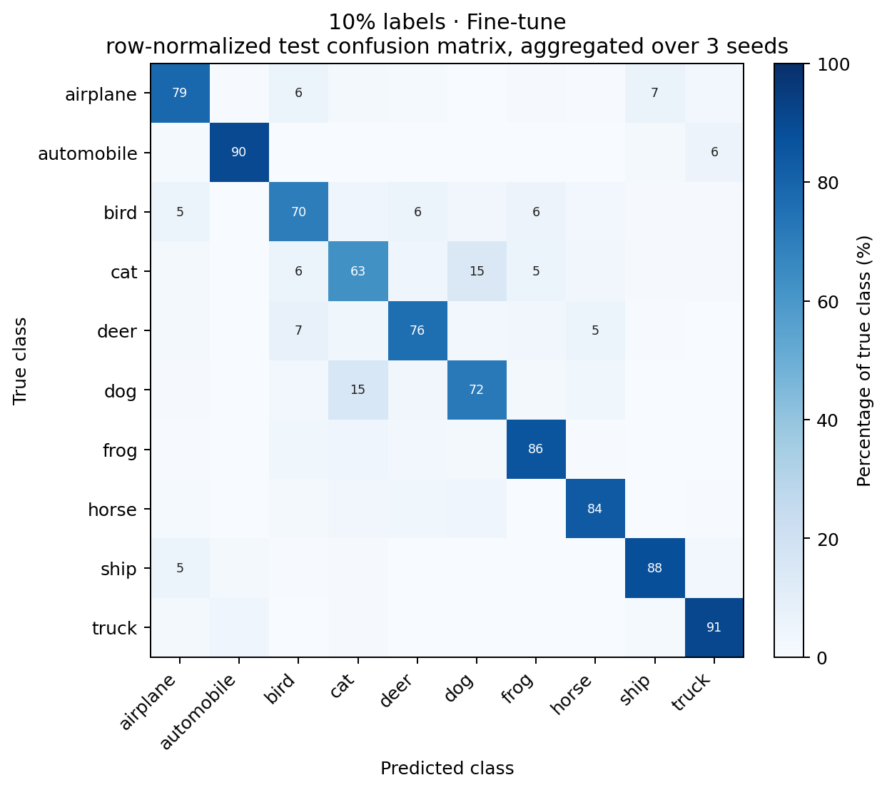

# SimCLR from Scratch on CIFAR-10

A compact, reproducible implementation of SimCLR with a focus on **low-label visual recognition**. The project pretrains a ResNet-18 encoder on 45,000 unlabeled CIFAR-10 images, then compares training from scratch, linear probing, and end-to-end fine-tuning with 1% and 10% labels.



## Highlights

- Implements the complete SimCLR path: two-view augmentation, ResNet-18 encoder, projection head, NT-Xent loss, checkpointing, and weighted k-NN evaluation.
- Uses fixed, class-balanced, nested 1%/10% labeled subsets and a disjoint 5,000-image validation set.
- Reports Accuracy and Macro-F1 over three downstream seeds, plus class-level confusion matrices.
- Keeps the CIFAR-10 test set untouched until model selection is complete.

## Method



The CIFAR-10 ResNet-18 replaces the ImageNet stem with a 3×3, stride-1 convolution and removes max pooling. Pretraining uses random resized crop, horizontal flip, color jitter, and grayscale transforms. The projection head maps 512-dimensional encoder features to 128 dimensions; downstream classifiers use the encoder representation before the projection head.

## Experimental protocol

| Component | Setting |
|---|---|
| SSL pretraining data | 45,000 CIFAR-10 train images; labels ignored |
| Validation data | 5,000 held-out train images, 500 per class |
| Test data | Official CIFAR-10 test set, 10,000 images |
| Labeled subsets | 1% = 450 images; 10% = 4,500 images |
| Encoder | CIFAR-adapted ResNet-18 |
| Projection head | 512 → 512 → 128 |
| SSL objective | NT-Xent, temperature 0.2 |
| SSL optimization | AdamW, batch 256, 100 epochs, cosine decay |
| Downstream seeds | 41, 42, 43 |
| Split seed / encoder seed | 42 / 42 |

The reported standard deviation measures downstream training randomness. All downstream runs reuse the same seed-42 pretrained encoder, so it does not include variance from SSL pretraining.

## Results

### CIFAR-10 test set

| Labels | Method | Accuracy (mean ± std) | Macro-F1 (mean ± std) |
|---|---|---:|---:|
| 1% | Scratch | 40.96 ± 0.29% | 40.60 ± 0.51% |
| 1% | **Linear Probe** | **67.71 ± 0.10%** | 67.47 ± 0.17% |
| 1% | Fine-tune | 67.68 ± 0.55% | **67.48 ± 0.71%** |
| 10% | Scratch | 71.61 ± 1.03% | 71.54 ± 1.10% |
| 10% | Linear Probe | 73.39 ± 0.06% | 73.10 ± 0.06% |
| 10% | **Fine-tune** | **79.75 ± 0.08%** | **79.70 ± 0.08%** |

With 1% labels, the frozen SimCLR representation improves test accuracy over scratch training by **26.75 percentage points**. Linear probing and fine-tuning are effectively tied, while the linear probe is more stable. With 10% labels, fine-tuning improves over the stronger 100-epoch scratch baseline by **8.13 percentage points**.

Full per-seed results are in [results/RESULTS.md](results/RESULTS.md) and [results/test_results.csv](results/test_results.csv).

## Training diagnostics



The NT-Xent loss falls from 3.51 to 1.78, positive-pair similarity rises from 0.75 to 0.96, and embedding standard deviation remains nonzero. Together these diagnostics indicate useful alignment without representational collapse.



At 1% labels, fine-tuning quickly reaches near-perfect training accuracy but does not beat the frozen probe on test data. At 10%, the additional supervision is sufficient for end-to-end fine-tuning to provide a clear gain.

## Confusion matrices

| 1% labels: Linear Probe | 10% labels: Fine-tune |
|---|---|
|  |  |

Cats, birds, and dogs are the most difficult classes. Automobiles and trucks are the strongest classes in both label regimes.

## Repository layout

```text
src/
  augmentations.py          # SimCLR and supervised transforms
  datasets/                 # reproducible splits and DataLoaders
  models/                   # ResNet-18, projection head, NT-Xent, classifier
scripts/
  train.py                  # SimCLR pretraining
  knn_eval.py               # weighted k-NN representation evaluation
  train_classifier.py       # scratch, linear probe, and fine-tune
  eval_classifier.py        # one-shot official test evaluation
  summarize_results.py      # tables and figures from saved metrics
results/
  RESULTS.md                # full per-seed test table
  test_results.csv          # machine-readable aggregate results
  figures/                  # curves and confusion matrices
splits/
  cifar10_seed42.json       # fixed split indices
```

## Reproduction

Create an environment and install a CUDA-compatible PyTorch build, then install the plotting dependencies:

```powershell
python -m venv .venv
.\.venv\Scripts\Activate.ps1
pip install torch torchvision numpy pillow matplotlib
```

Download CIFAR-10 once, then create the fixed split:

```powershell
python -m src.datasets.cifar10
python -m src.datasets.create_splits
```

Pretrain SimCLR:

```powershell
python scripts\train.py `
  --epochs 100 --batch-size 256 --temperature 0.2 `
  --run-seed 42 --split-seed 42 --device cuda `
  --output-dir outputs\pretrain\resnet18_100epoch_seed42
```

Train a 10% fine-tuning run:

```powershell
python scripts\train_classifier.py `
  --mode fine_tune `
  --pretrained-encoder outputs\pretrain\resnet18_100epoch_seed42\checkpoints\encoder.pth `
  --label-percentage 10_percent --epochs 30 `
  --encoder-lr 1e-4 --classifier-lr 1e-3 `
  --run-seed 42 --split-seed 42 --device cuda `
  --output-dir outputs\classification\fine_tune_100ep_10percent_seed42
```

Evaluate the validation-selected checkpoint once on the official test set:

```powershell
python scripts\eval_classifier.py `
  --checkpoint outputs\classification\fine_tune_100ep_10percent_seed42\checkpoints\best.pth `
  --device cuda
```

Regenerate the tracked result tables and figures:

```powershell
python scripts\summarize_results.py
```

## Current limitations

- Variance is measured across downstream seeds only; multiple independent SSL pretraining seeds remain future work.
- Experiments currently use CIFAR-10 and ResNet-18 only.
- The strongest 1% result suggests that regularized or partial fine-tuning could improve data efficiency further.
